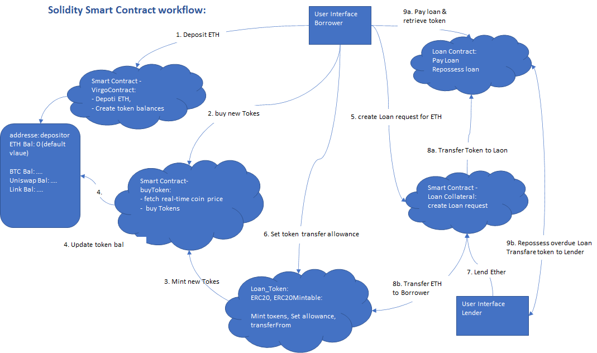

# PROJECT3: VIRGO-DEFI SOLIDITY CONTRACT

<<<<<<< HEAD

# Overview

The aim of the project is to build an appliacation that will allow users to be able to use their token as collaterals for loans.
The program is built using SMART contract on Solidity.A users who can deposit Etherium into the contract can also initiate a process to book a loan against his/her deposit.
i.e the user can borrow ETH against Crypto holdings by applying certain LTV (<60%) & term which determines rate.

=======
>>>>>>> 98c05ca9d19db93d20e44b60933b3c5626e6ccd5
# INTRODUCTION

The breakout of the cryptocurrency and blockchain markets during the last decade created one of the most disruptive forces in 
the global financial markets.

The concept of tokenization is now being applied across different industries in what blockchain enthusiasts are calling the
decentralization of the financial markets. This allows investors to use different crypto assets as collateral for loans.
Crypto investors can now access cash tied to their crypto assets without necessarily selling their cryptocurrencies.

Short for decentralized finance, DeFi is an umbrella term for financial services offered on public blockchains. 
Like traditional banks, DeFi applications allow users to borrow, lend, earn interest, and trade assets and derivatives, 
among other things. The collection of services is often used by people seeking to borrow against their crypto holdings to 
place even larger bets.

<<<<<<< HEAD

  <b> ENVIRONMENTAL PREREQUISITES </b>

=======

  <b> Setting up the contract </b>

>>>>>>> 98c05ca9d19db93d20e44b60933b3c5626e6ccd5
	* [Remix IDE](https://remix.ethereum.org) to create the contract using Solidity programming Language.

* [Ganache](https://www.trufflesuite.com/ganache) a Development blockchain with prefunded account addresses which can be uused for testing purposes. 

* [MetaMask](https://metamask.io) a Crypto wallet and gateway to blockchain apps. Download the metamask Browser extension and pin it to your favorite browser and point it to the localhost:8545 by createting a 'testnet' chain, or replace the port with what you have set in your workspace.

<<<<<<< HEAD
# Design

  <b> Design </b>

The Project invloves building the 5 smart contracts which works together  as a unit to provide the best user experience.

Virgo Contract​ ==> Buy Token ==> Loan Token​ ==> Collateral ==> Loan​

# Process workflow

  <b> Workflow </b>

The process flow involves the following steps highlighted below.
=======

	

# OUR MISSION
>>>>>>> 98c05ca9d19db93d20e44b60933b3c5626e6ccd5

•	virgoContract > deposit ETH, create token balances (initial zero) 

•	buyToken > fetch real-time pricing, purchase tokens

•	Loan_token > mint tokens

•	buyToken > update virgoContract balances 

•	Collateral > create loan_request

•	Loan_token > set token transfer allowances

•	Loan > upon loan approval, loan object is created

•	Collateral > transfer tokens to loan contract, transfer ETH to borrower

•	Loan > repay loan before due date, or repossess overdue loan

<<<<<<< HEAD
=======
# SCOPE
>>>>>>> 98c05ca9d19db93d20e44b60933b3c5626e6ccd5

# Virgo Contract​

  <b> Virgo Contract </b>

[`virgoContract.sol`](virgoContract.sol) -- virgo contrat create the Crypto Portfolio and Token Specific Account Tracking​. It achieves the following:

<<<<<<< HEAD
•	Allow users to deposit ether.
=======
# VIRGO CONTRACT
•	Our Virgo Smart Contract allows you to deposit ether.
>>>>>>> 98c05ca9d19db93d20e44b60933b3c5626e6ccd5

•	Map the sender address to their respective coin balance.

•	With the contract, we can update the users’ coin balances with the equivalent token and

•	Finally the contract reduces the ether balance with the amount of token purchased

<<<<<<< HEAD

Describe each of the contract and include the program with a screenshot

# Buy Token​

  <b> Buy Token </b>

[`Oracle.sol`](Oracle.sol) ---This contract determing the pricing.

[`P3_buyToken.sol`](P3_buyToken.sol) -- This contract calls the oracle.sol when the user is buying the token and uses the pricing from the oracle.sol contract to determing the number of token the user can buy.

It achieves the following:

=======
# CURRENT FUNCTIONALITY
•	Borrow ETH against Crypto holdings by applying certain LTV (<60%) & term which determines rate

## BUY TOKEN
>>>>>>> 98c05ca9d19db93d20e44b60933b3c5626e6ccd5
•	Import real-time market prices using Kovan Network

•	Use ERC-20 to create tokens

•	Buy Tokens based on user’s token Symbol (e.g. BTC, UNI or LINK) along with the ETH Buy Amount

•	Calculates no of Tokens to be minted by dividing ETH BuyAmount / TokenPrice

•	Mint contract to issue new tokens for Owner

<<<<<<< HEAD

# Loan Token​

  <b> Loan Token​ </b>

[`P3_loan_token_v2.sol`](P3_loan_token_v2.sol) ---This contract  achieves the following :
=======
## LOAN TOKEN
>>>>>>> 98c05ca9d19db93d20e44b60933b3c5626e6ccd5

•	Issues Fungible Tokens following ERC20 and ERC20Mintable standards 

•	Token minted: Bitcoin, Uniswap, LINK 

•	Token approves address spending allowances to support ‘transferFrom’ functionality

<<<<<<< HEAD
# Collateral​

  <b> Collateral​ </b>

[`P3_collateral_test_v2.sol`](P3_collateral_test_v2.sol) ---This contract  achieves the following :
=======
## COLLATERAL CONTRACT
>>>>>>> 98c05ca9d19db93d20e44b60933b3c5626e6ccd5

•	Creates loan request object based on user's token collateral, collateral amount, loan amount, payoff amount and duration

•	Loan object imported from Loan contract

•	Provides function for a lender to accept loan request by

# Loan

  <b> Loan​ </b>

[`P3_loan_v2.sol`](P3_loan_v2.sol) ---This contract  achieves the following :

<<<<<<< HEAD
=======
## LOAN CONTRACT
>>>>>>> 98c05ca9d19db93d20e44b60933b3c5626e6ccd5
•	Creates Loan Object with attributes
		1.Borrower 
		2.Lender 
		3.Collateral amount 
		4.Loan amount 
		5.Payoff amount 
		6.Loan Duration 

•	Pay Loan: Repay the ETH payoff amount and transfer token to borrower

•	Repossess Loan: Overdue Loan closed and Transfer collateral tokens to Lender

<<<<<<< HEAD
# Future Enhancements:
=======
## FUTURE ENHANCEMENTS:
>>>>>>> 98c05ca9d19db93d20e44b60933b3c5626e6ccd5
•	User Interface (UI)

•	Crypto sales

•	Enhanced loan functionality incl. periodic interest payments, LTV liquidation triggers

•       Crypto lending

•	Integrate ETH-wrapped Crypto liquidity

•	Smart contract code: enhanced error catching & security

•	Option to transact in Fiat Currency

•	Expand Crypto Range

•	Crypto staking

# Resouces ---link to video